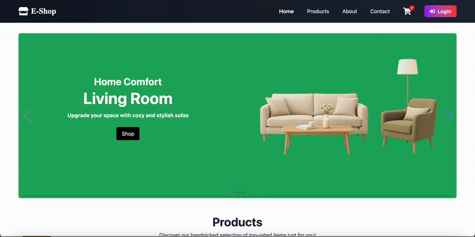

# e-commerce-app Backend README

## 🎬 Demo

---

## Overview
- Production-grade e-commerce backend built with Spring Boot and Spring Cloud.
- Microservices cover users, addresses, products, inventory, cart, orders, and payments.
- Infrastructure services run via Docker Compose: MySQL, Redis, Kafka, Keycloak.
- Gateway provides unified routing and authentication; Eureka enables service discovery; services communicate via OpenFeign and Kafka for asynchronous, event-driven workflows.

## Tech Stack and Versions
- Framework
  - Spring Boot `3.5.7`
  - Spring Cloud BOM `2025.0.0`
  - Spring Cloud Gateway (Reactive)
  - Netflix Eureka (Server/Client)
  - OpenFeign (service-to-service calls)
- Security & Auth
  - Spring Security, OAuth2 Resource Server / OAuth2 Client
  - Keycloak (OIDC, RBAC, Admin Client)
- Data & Cache
  - MySQL (`mysql-connector-j`)
  - Spring Data JPA
  - Redis (Spring Data Redis / Reactive Redis)
- Messaging & Events
  - Kafka (`spring-kafka` / `spring-kafka-test`)
  - AWS MSK IAM Auth (`aws-msk-iam-auth 2.3.5` used by some services)
- Business & Utilities
  - Stripe (`stripe-java 31.0.0`)
  - ModelMapper (`3.2.4`)
  - Spring Statemachine (orders: `4.0.1`)
  - Actuator, Validation (`spring-boot-starter-actuator`, `spring-boot-starter-validation`)

> Versions sourced from `pom.xml` and configs: payment uses `stripe-java 31.0.0`; user uses `keycloak-admin-client 26.0.7`; order and product use `aws-msk-iam-auth 2.3.5`, `modelmapper 3.2.4`, and `spring-statemachine-starter 4.0.1`.

## Microservices and Responsibilities
- `gateway`
  - Unified entrypoint, routing, and authentication via Spring Cloud Gateway (WebFlux).
  - OAuth2 Client / Resource Server with Keycloak; uses Reactive Redis (e.g., caching/session).
  - Injects user data into downstream request headers (`X-User-Id`, `X-User-Email`, `X-User-Name`).
  - Resilience4j Circuit Breaker available.
  - Dependencies: Actuator, Security, OAuth2, OpenFeign (if used), Reactive Redis, Eureka Client.
- `eureka`
  - Service registry (Eureka Server).
  - Dependencies: Actuator, Web.
- `user`
  - User profile and account management; integrates with Keycloak (Admin Client) to create/sync users and roles.
  - Dependencies: Web, Data JPA, Validation, Security, OAuth2 Resource Server, OpenFeign, ModelMapper, MySQL, Eureka Client, Keycloak Admin Client.
- `address`
  - User address management.
  - Dependencies: Web, Data JPA, Validation, Security, OAuth2 Resource Server, OpenFeign, ModelMapper, MySQL, Actuator, Eureka Client.
- `product`
  - Product catalog and search; leverages Redis for hot data caching.
  - Dependencies: Web, Data JPA, Validation, Security, OAuth2 Resource Server/Client, ModelMapper, Redis, Kafka, AWS MSK IAM Auth, Actuator, OpenFeign, MySQL, Eureka Client.
- `inventory`
  - Stock reservation and decrement; subscribes to order/payment events for inventory updates.
  - Dependencies: Web, Data JPA, Security, OAuth2 Resource Server/Client, ModelMapper, Kafka, AWS MSK IAM Auth, Actuator, OpenFeign, MySQL, Eureka Client.
- `cart`
  - Shopping cart backed by Redis; validation and authorization supported.
  - Dependencies: Web, Validation, Security, OAuth2 Resource Server/Client, ModelMapper, Redis, Actuator, OpenFeign, Eureka Client.
- `order`
  - Order creation, lifecycle, and payment reconciliation; uses Spring Statemachine; interacts with Kafka.
  - Dependencies: Web, Data JPA, Validation, Security, OAuth2 Resource Server/Client, ModelMapper, Kafka, AWS MSK IAM Auth, Statemachine, Actuator, OpenFeign, MySQL, Eureka Client.
- `payment`
  - Stripe integration (create payment intents, webhook callbacks and verification).
  - Webhook endpoints allow unauthenticated access but strictly verify Stripe signatures; service endpoints still use OAuth2.
  - Dependencies: Web, Data JPA, Validation, Security, OAuth2 Resource Server, ModelMapper, Kafka, Stripe, Actuator, OpenFeign, MySQL, Eureka Client.

## Architecture Notes
- Service discovery: business services (user/address/product/inventory/cart/order/payment) register as Eureka Clients to `eureka`.
- Gateway: all external traffic goes through `gateway`; internal calls via OpenFeign or Kafka-driven events.
- Authentication & user identity
  - Keycloak provides OIDC; services validate JWT via `spring-boot-starter-oauth2-resource-server`.
  - `gateway` parses claims and injects headers to downstream services to avoid repeated token parsing.
  - Services use `keycloakId` consistently as the cross-domain identity.
- Data & cache
  - MySQL for primary relational data; Spring Data JPA for persistence.
  - Redis for cart storage and product hot cache; Gateway uses Reactive Redis.
- Messaging
  - Kafka for events across orders, inventory, payment, etc.; AWS MSK IAM used in certain environments.
- Observability
  - Actuator for health and basic metrics; services expose endpoints suitable for monitoring.

## Prerequisites
- JDK `21`
- Maven `3.9+`
- Docker and Docker Compose

## Local Quick Start (excluding Kubernetes)
1) Start infrastructure (from repo root)
   - `docker compose up -d`
   - Or start selectively: MySQL, Redis, Kafka/Zookeeper, Keycloak (refer to ports/configs in `docker-compose.yml`).
2) Configure environment variables
   - Each service reads from `.env` or `application-dev.yml` (example keys):
     - Database: `DB_HOST=mysql`, `DB_PORT=3306`, `DB_NAME=ecommerce`, `DB_USERNAME`, `DB_PASSWORD`
     - Redis: `REDIS_HOST=redis`, `REDIS_PORT=6379`
     - Kafka: `KAFKA_BOOTSTRAP_SERVERS` (and MSK IAM related if used)
     - Keycloak: `KEYCLOAK_AUTH_URI`, `KEYCLOAK_TOKEN_URI`, `KEYCLOAK_JWK_SET_URI`, client `clientId/clientSecret`
     - Stripe (payment service): `STRIPE_SECRET_KEY`, `STRIPE_WEBHOOK_SECRET`
3) Start microservices (one or all)
   - Build: `mvn -q -DskipTests clean package`
   - Run: cd into service directory, `mvn spring-boot:run` or `java -jar target/<service>-0.0.1-SNAPSHOT.jar`
4) Access APIs via Gateway
   - Check `gateway/application.yml` for routes; all external APIs go through the gateway.
5) Initialize Keycloak (if needed)
   - Administration address and port mappings are defined in `docker-compose.yml`.
   - Realm/user import configurations are provided (see `Dockerfile.keycloak` and related JSON) for quick setup.

## Postman Testing
- Collection: `ecomm-app.postman_collection.json`
- Usage
  - Import into Postman and create environment variables:
    - `gateway_base_url`: Gateway base URL (e.g., `http://localhost:<port>`)
    - `access_token`: a Keycloak-issued JWT (via login flow or a pre-request script)
  - Add `Authorization: Bearer {{access_token}}` to protected requests.
  - For local webhook testing, expose a reachable URL and set `STRIPE_WEBHOOK_SECRET` correctly.

## Directory Structure (backend)
- Root
  - `docker-compose.yml`: local infrastructure (MySQL/Redis/Kafka/Keycloak, etc.)
  - `ecomm-app.postman_collection.json`: Postman collection
  - `envs/`: environment samples and configs
  - `scripts/`: helper scripts (e.g., `bootstrap-local.sh`)
  - `docs/`: documentation (Kubernetes references present but not covered here)
- Services
  - `gateway/`, `eureka/`, `user/`, `address/`, `product/`, `inventory/`, `cart/`, `order/`, `payment/`
  - Each includes: `pom.xml`, `application.yml`/`application-dev.yml`, `.env`, source code, and security/config classes (e.g., `SecurityConfig.java`).

## Auth and Security Highlights
- Resource servers: services validate Keycloak JWT via `spring-boot-starter-oauth2-resource-server`.
- Client mode: some services (`gateway`, order/inventory) use `spring-boot-starter-oauth2-client` for Keycloak interactions.
- Roles & permissions: custom role resolvers map Keycloak roles for fine-grained authorization.
- Gateway header injection: `gateway` adds user identity headers to downstream calls.
- Webhook exception: `payment` webhook endpoint is publicly reachable but strictly verifies Stripe signatures.

## Data and Cache
- MySQL: shared database `ecommerce` (example URL `jdbc:mysql://mysql:3306/ecommerce`); each service owns its JPA entities.
- Redis
  - `cart` stores cart data in Redis.
  - `product` caches hot product data in Redis.
  - `gateway` uses Reactive Redis for session/cache scenarios.

## Messaging and Events
- Kafka
  - `order`, `inventory`, `product`, `payment` use `spring-kafka` to produce/consume events.
  - In MSK environments, configure IAM auth with `aws-msk-iam-auth`.
- Event flow: order creation/payment results/stock updates are coordinated via events.

## Observability and Health
- All services enable Actuator (e.g., `/actuator/health`) for liveness/readiness and basic monitoring.

## FAQ
- Port or route mismatches?
  - Rely on service `application.yml`/`application-dev.yml` and `docker-compose.yml` for authoritative values.
- Keycloak token issues?
  - Verify `issuer`/`JWK Set URI`/`token`/`auth` endpoints, client credentials, and clock synchronization.
- Stripe webhook verification fails?
  - Confirm `STRIPE_WEBHOOK_SECRET` and the presence of Stripe signature headers; for local dev, ensure external reachability.
- Kafka connectivity errors?
  - Local uses `PLAINTEXT`; cloud/managed MSK requires IAM and proper credentials/dependencies.

## Associated Frontend Repository
- GitHub: https://github.com/oneyx88/ecommerce-frontend
- The frontend expects the backend gateway to be reachable and CORS configured appropriately. Follow the frontend README for environment setup and base URL configuration.
